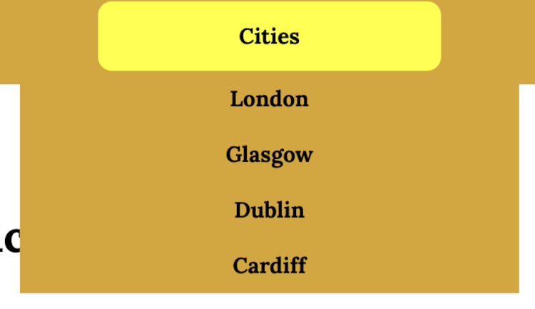
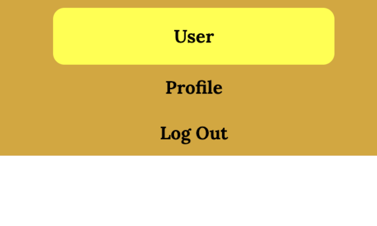
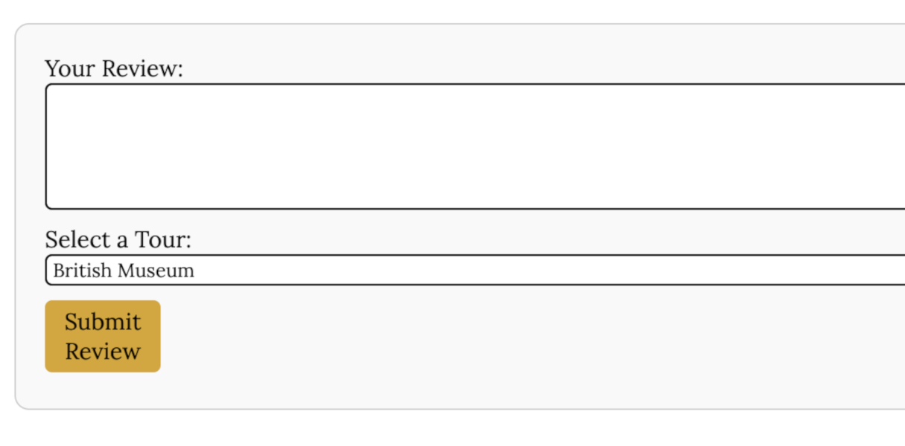
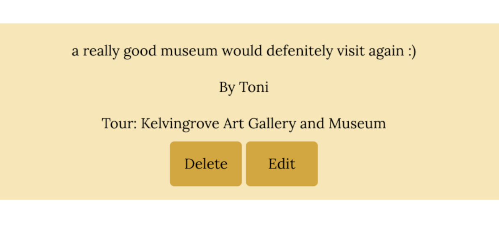

# Big City Tours

Big City Tours is a web application that showcases tours in biggest cities of England, Scotland, Ireland and Whales. Users can browse city tours, read and leave reviews, and manage their profiles.

## Installation
1. Clone the repository:
   

## Features 
- View tours and reviews for London, Glasgow, Dublin, and Cardiff.

- Logged-in users can:
  - Leave reviews for tours.
  - Edit or delete their own reviews.
  - View their profile with all their reviews.
  
  
  
  

## Tech Stack
- **Backend:** Python, Flask
- **Frontend:** HTML, CSS, JavaScript,Jinja2
- **Database:** PostgreSQL
